# Seção 1

# Projeto ABAPRJ - Desenvolvimento em Django

Nosso projeto para a ONG Projeto **ABAPRJ** foi desenvolvido utilizando o framework 
**Django**, com duas equipes front-end e back-end.


# Front-End

**Wikten:**

- **Tarefas:** Criação e estilização da página inicial de administração e da página home, 
estilização da tabela em listagens e da listagem de voluntários, além da criação do rodapé
e cabeçalho.

- **Detalhes Técnicos:** Utilização de HTML, CSS e JavaScript para construir uma interface 
amigável e responsiva. Implementação de CSS para estilizar consistente e adaptável em cada 
etapa do designer detalhado previamente com uso de Ferramenta de design colaborativa e 
online como Figma.

**Laíze:**

- **Tarefas:** Criação e estilização da página de ações sociais e da página de resultados de 
buscas, estilização dos botões de todas as páginas, além de alterações no rodapé e cabeçalho.

- **Detalhes Técnicos:** Utilização de HTML, CSS e JavaScript para construir uma página 
amigável e responsiva. Implementação de CSS para estilizar consistente e adaptável em cada 
etapa do designer detalhado. 

**João:**

- **Tarefas:** Criação e estilização das páginas de login e candidatura, documentação, documentação final, edição
de vídeo do final.

- **Detalhes Técnicos:** Utilização de HTML, CSS para construir uma interface amigável

# Back-End

**Página View**

**Pedro:** Em "cadastrosAdmin," Pedro criou as seguintes class-based views:

```
● Gerenrecia
● CadAdmin
● AdminCadCreate
● AdminUpdateView
● FuncUpdareView
● AdminCadUpdate
● AdminlistView
● CadastroEspelhoLista
● CadDeleteView
● FuncDeleteView
● AdminDeleteView
```
Em "cadastros",Pedro concluiu:

```
● CadCreateView
● CadUpdateView
● CadListView
● CadCompleteView
● ValidarFuncionário
```
**Stefany:** Em "cadastrosAdmin,"Stefany criou as seguintes class-based views:

```
● AdminHome
● FuncListView
● DadosCadastroCriancas
● DadosCasdastroVoluntarios
● DadosCadastrosAdmin
● ProcurarCriança
● ProcurarVoluntario
● ProcurarAdmin
```
Em "cadastros,"Stefany concluiu:

```
● Chamalogin
● ChamaHome
● ChamaApoie
● CadVoluntario
● DadosCadastros
● Procurar
```
**Trabalho  Conjunto:** Juntos, concluímos:

```
● Esqueci_senha
● GerarPayload
```
# Página Model

**Pedro:** Pedro criou as seguintes tabelas:

```
● Admin
● Login
```
**Stefany:** Stefany criou:

```
● Cadastro Voluntario
```
**Trabalho Conjunto:** Juntos,concluímos:


```
● EsqueciSenha
● MembroFamilia
● Cadastro
```
# Páginas HTML

**Pedro:** Pedro desenvolveu todas as partes relacionadas às tabelas, incluindo as
funções de editar, excluir e concluir nos seguintes HTMLs do aplicativo 
"cadastrosAdmin":


```
● AdminEspelho_confirm_delete.html
● AdminEspelho_list.html
● CadastroEspelho_confirm_delete.html
● CadastroEspelho_list.html
● CadastroVoluntarioEspelho_confirm_delete.html
● CadastroVoluntarioEspelho_list.html
```
No aplicativo "cadastros", ele trabalhou em:

```
● Cadastro_list.html
● Cadastro_form.html
● base.html
```
Além disso, Pedro criou alguns formulários, como:

```
● AdminEspelho_form.html
● CadastroEspelho_form.html
● Cadastro_form.html(noaplicativo"cadastros")
```
**Stefany:** Stefany desenvolveu todas as páginas relacionadas à pesquisa e filtros,
 incluindo:

No aplicativo "cadastrosAdmin":

```
● Dados_cadastroAdmin.html
● ProcurarAdmin.html
● Resultados_procurarAdmin.html
● Dados_cadastroCrianca.html
● ProcurarCrianca.html
● Resultados_procurarCrianca.html
● Dados_cadastroVoluntario.html
● ProcurarVoluntarios.html
● Resultados_procurarVoluntario.html
```
No aplicativo "cadastros":

```
● Dados_cadastro.html
● Procurar.html
● Resultados_procurar.html
```
Ela também criou EsqueciSenha_form.html no aplicativo "cadastros".


**Detalhes Específicos:**

```
● A paginação de conteúdo foi feita por Stefany.
● Ela também criou listas com os nomes dos voluntários e admins, presentes
em apoie.html, Index.html, e admin.html.
```
**Trabalho Conjunto:** Pedro e Stefany desenvolveram a lógica do payload e pix, 
adicionando-os no index.html, além de integrarem imagens estáticas e CSS no Django.

# Outros Contribuintes:

**João:**  Desenvolveu login.html e CadastroVoluntario_form.html, com adição do
formulário crispy feita por Pedro Cezar.

**Front-End Team:** Responsável por todo o CSS. João especificamente cuidou do CSS 
das páginas de login e cadastro de voluntário. Wikten fez a responsividade de algumas
paginas para telas de celular e tablets, e Laize fez a da pagina apoie.html.

# Página URLs

**Pedro:**  Pedro adicionou máscaras hash em cada URL.

# Lógica do Sistema

A lógica de cadastro e edição é gerenciada através das "Generic Views" do Django, 
facilitando operações de CRUD (Create, Read, Update, Delete). Essas class-based views 
são utilizadas para tarefas como cadastro de novos itens, leitura de itens cadastrados, 
atualização e deleção de itens.

# Tecnologias Utilizadas

```
● Django: Framework principal utilizado para desenvolvimento backend, gerenciamento 
de lógica de negócios e manipulação de dados.
● HTML/CSS/JavaScript:Tecnologias básicas para desenvolvimento front-end, garantindo 
interfaces interativas e responsivas.
● APIsExternas: Integração para processamento de pagamentos e envio de e-mails.
● BibliotecasDjango: Importação de bibliotecas adicionais para facilitar a navegação e 
manipulação de dados.
```
# Implementação

```
● ViewsPersonalizadas: Criação de funções personalizadas nas views para coleta e alteração
de campos via métodos HTTP (GET, POST).
● Deploy: Preparação de campos necessários para deploy, com pendência apenas da hospedagem 
do banco de dados para finalização.
● Organização do Código:  Uso de requisitos e indentação adequada com explicações detalhadas 
para melhor compreensão do código.
● UtilizaçãodeFunçõesNativasdoDjango: Para maior organização, como nomenclatura form, list, 
template, entre outros específicos, evitando a criação de novos campos para manipulação.
```
# Histórico de Commits

Todas essas informações podem ser comprovadas pelo histórico de commits, que contém todos os 
commits feitos até aqui e as respectivas pessoas que os fizeram.

# Seção 2

# Evidências

**Realizado por: João Pedro Guimarães Fernandes**

# Quinta-Feira,21/03/24

O grupo compartilhou entre si as ideias para o projeto, cada um dando seu
ponto de vista e suas opiniões, tentando de diferentes formas e maneiras 
como, e de que jeito, iniciar o projeto. Após uma reunião virtual com todos os 
membros do grupo, a forma da abordagem foi finalmente decidida, porém, 
devido ao forte temporal e as ventanias, nos comunicamos com diferentes ONGs,
ações comunitárias e empresas sem fins lucrativos de forma totalmente online, 
tendo em vista a situação externa.


Os membros do grupo se separaram em tarefas: procurar links de ONGs, ações 
comunitárias e empresas sem fins lucrativos, para que seja possível entrar em 
contato por meio da internet. Os responsáveis por coletar os links e informações
 foram **Wikten**, **Laize**, **Pedro** e **Stefany**. Além disso, **Wikten** e **Laize** foram os 
responsáveis por entrar em contato.

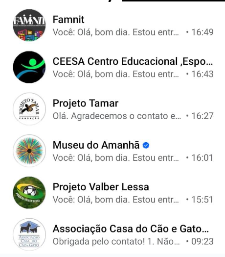
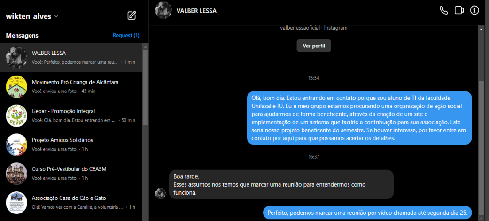
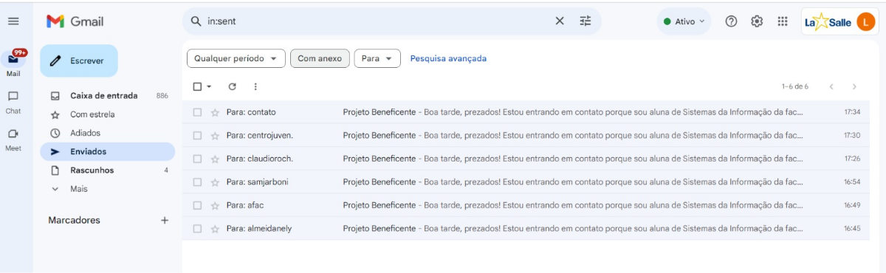

# Evidências,21/03/24
IMAGEMIMAGEM
IMAGEM
Imagens das tentativas de contato com as ONGs, ações comunitárias e empresas 
sem fins lucrativos
Drive com os vídeos gravados durante as interações:

https://drive.google.com/drive/folders/1zsryT2u40-I8n48Wg9LMDGjnFSA5Gv4h?usp=sharing-

# Sábado,23/03/24

Neste dia, decidimos nos juntar a ONG ABAPRJ, além disso, realizamos uma reunião
online com um dos membros do projeto, Nely Mello, onde nos foi passado as ideias 
e requisitos para o sistema ofertado. Requisitos como um banco de dados para 
armazenar os dados referentes a crianças, se há visitas marcadas e consultas. Eles 
alertaram sobre um déficit de tecnologia e nos informou que eles atendem um 
volume grande de clientes, fazendo com que eles tenham uma dificuldade maior de 
guardar e armazenar tantos arquivos, ainda mais fisicamente, armazenando tudo em 
papel, logo, um banco de dados digital, em site, seria de imensa ajuda.  

# Segunda,01/04/24

Aqui começamos a dialogar em relação a um dia para realizarmos uma reunião com a
 senhora Nelly Mello, para que seja possamos conhecer melhor e que seja possível a 
iniciação do protótipo. Confirmamos na sexta-feira, dia 05/04/24 para que houvesse a
coleta de requisitos por meio de uma reunião virtual.

# Sexta,05/04/24

A reunião começou às 16 horas e durou cerca de 1 hora, além da portabilidade do site 
para mobile, tivemos alguns requisitos que foram compilados em uma ata.
Descrição da Ata: Ficha de anaminelse da assistente social, relatório, site, cores (azul, preto, 
vermelho e verde), modelos de necessidade, exibir quem atendeu o familiar ou a família, 
registro da criança, dos pais e do tipo de demanda(necessidade), gráficos de demandas
(estatísticas), cadastro das Empresas parceiras (documentadas), colocar situação civil das 
crianças e dos pais, no site exibir uma opção para a possibilidade das empresas se tornarem 
parceiras, capital de pessoas - para os jovens enviarem seus currículos para a ONG enviar para 
empresas, restrição de acesso ao banco de dados e a apresentação no site das ações sociais e etc.

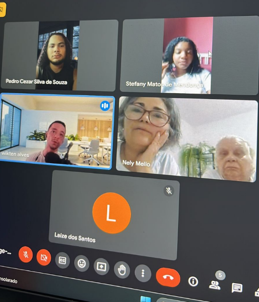
Imagem da reunião realizada com Nelly Mello.

# Sábado,06/04/24

O grupo começou o desenvolvimento da ata da reunião que seria entregue a Nelly Mello, além 
disso realizamos algumas outras tarefas, tentativas de desenvolvimento do site, digitalização 
da logo da ABAPRJ e pesquisas em relação a interface que seria utilizada.


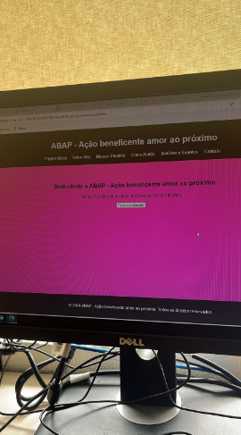

Imagens dos testes iniciais do site.

# Domingo,07/04/24

Finalização e entrega da ata da reunião. Ata redigida por Pedro Cézar:


# Terça,13/04/24

Marcamos uma reunião online da equipe, visando alinhar os pensamentos e definir 
algumas metas para os membros.
Algumas das metas propostas para a semana foram a entrega da página home e o 
banco de dados físico do projeto. Além disso, um dos membros do grupo definiu as 
páginas a serem programadas durante a semana.


# Quinta,16/04/24

Começamos a dialogar sobre marcar outra reunião com a Nelly para exibir nosso 
protótipo e debater alguns assuntos.

# Sexta,19/04/24

Na quinta, a página de home para computador estava perto de ser concluída,
além da aplicação da responsividade para celular. Ao finalizar a primeira página, 
a construção da próxima se tornaria mais rápida, conseguimos estipular uma data 
de entrega até sábado, mas a entrega de verdade estava decidida para o domingo.

# Sábado,20/04/24

Com a primeira página, a página home, finalizada, faltava apenas aplicar a responsividade 
para celular e concluir a segunda página. Em paralelo a isso, estava sendo feito o formulário
dos funcionários e o de login, o de crianças já havia sido finalizado. O grupo se uniu à noite 
para finalizar alguns desses quesitos que ainda estavam pendentes.

# Sexta,03/05/24

Demos segmentos ao planejamento e execução de outras páginas do projeto.

# Sábado,04/05/24

Foi realizada uma atualização rápida para implementar controles de redução da DIV em 
colaboração com a equipe de front-end. Além disso, a segunda página estava para ser 
finalizada, faltando apenas incluir os conteúdos, fazer com que os códigos ficassem no
eixo e a responsividade para celular.

Em quanto isso, foi finalizado o banco de dados do projeto, além de um conceitual.

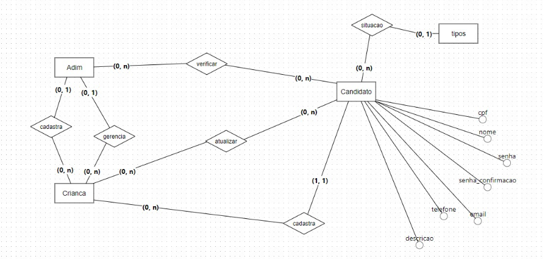


Ao final do dia foi realizada uma reunião online com parte dos integrantes do grupo 
onde discutimos diversos tópicos relacionados ao desenvolvimento do sistema. Em 
primeiro lugar, se todos aprovavam o modelo que foi desenvolvido, e se todos 
concordaram com sua implementação. Além disso, foram definidas as páginas essenciais 
do sistema, incluindo a página inicial (Home), as páginas de registro/login, registrar criança, 
atualizar criança, e as páginas de administração, como "Verificar Candidatos" e "Verificar 
Atualizações de Crianças". Para os próximos passos, cada membro da equipe ficou 
responsável por uma parte específica do desenvolvimento, e estabelecemos um prazo para 
a conclusão das implementações. As ações a serem tomadas foram atribuídas aos respectivos
 membros, e marcamos a data da próxima reunião para acompanhar o progresso e discutir 
novos tópicos.

# Domingo,04/05/24

Fizemos mais uma reunião no começo da noite, para garantir que possamos concluir as páginas 
principais a tempo, então definimos metas claras e alcançáveis para cada uma delas, mesmo que 
temporariamente sem a responsividade adequada. Com apenas um mês restante, era crucial focar 
nos elementos essenciais para ter um sistema funcional.

Ao final da reunião o que foi declarado o que necessitava ser finalizado:

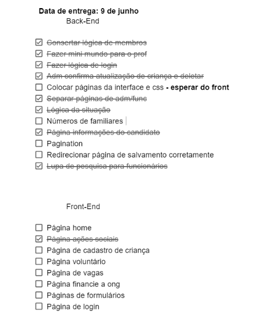

Tabela feita por **Stefany**

# Domingo,05/05/24

O grupo progrediu um pouco mais nas configurações do site, Wikten conseguiu finalizar algumas 
imagens e formatos pendentes, enquanto Pedro e Stefany estavam tentando replicar a lógica da 
programação dos pais para todos os outros tipos de pessoas, crianças, admins e funcionários 
associados. O home onde ficariam as crianças já estava praticamente finalizado.

# Sábado,11/05/24

Wikten passou a tarde editando o conteúdo da home principal, expondo o que a ONG significava e 
os objetivos, enquanto eu atualizava a documentação pendente.

# Domingo,12/05/24

A previsão para finalizar o back-end era de 3 semanas, o CSS estava pra ser feito pois era uma das 
partes com as maiores pendências no momento. Foram definidas as páginas que ainda necessitavam
de CSS. Eu, João Pedro, estava fazendo a página de login e atualizando no GitHub. Enquanto tudo isso 
acontecia, o Wikten estava tentando fazer um fork para atualizar algumas coisas do código com Django.

# Segunda,13/05/24

Eu estava finalizando as páginas de login e cadastro, fazendo o CSS, dei algumas sugestões de como deveria
 ficar as cores e imagens, foi aprovado e continuei editando as páginas. O html seria utilizado de base para o 
formulário oficial feito em Crispt ser inserido por cima, apenas mantendo o CSS.

# Terça,14/05/24

No final da tarde marcamos uma reunião presencial que iria ocorrer no final da semana, onde eu iria até o 
local para debater alguns assuntos e tirar algumas fotos, porém, já adiantando, ocorreu um imprevisto e a 
reunião teve que ser cancelada.

# Sexta,17/05/24

Terminei de aplicar a responsividade na página de de cadastro e login, além de finalizar a logo. Nesse dia acabei
por cancelar a reunião pois tive um imprevisto familiar e nenhum outro membro do grupo tinha condições 
para ir naquele momento.


# Sabado,18/05/24

Reunião marcada para o fim da noite, aproximadamente 19 horas, O objetivo era deixar o site oficial pronto. 
Enquanto a reunião não começava, alguns membros do grupo ficaram estudando algumas coisas de CSS e Django,
a Laize havia finalizada a página web dela e atualizado o GitHub. Nesse dia, o foco foi o CSS pendente. Wikten no
final da tarde finalizou a uma das outras páginas pendentes, e Pedro ficou arrumando alguns links para navegar 
entre as páginas e mascarando algumas URLs 
A nossa reunião começou poucos minutos depois das 19 horas, o assunto principal foi como estávamos em relação a
o front-end,quais eram as pendências e quais eram as urgências. Fizemos uma lista do que ainda faltava: 

**Páginas que precisam de css:**
**Página de cadastro de criança**
**Página lista de voluntários e candidatos**
**Página lista de crianças**
**Página de pesquisa**
**Página de visualização de dados de criança**
**Página de visualização de dados de candidato**

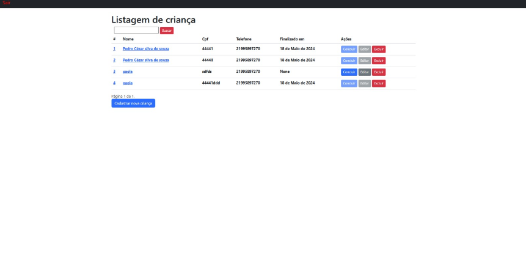
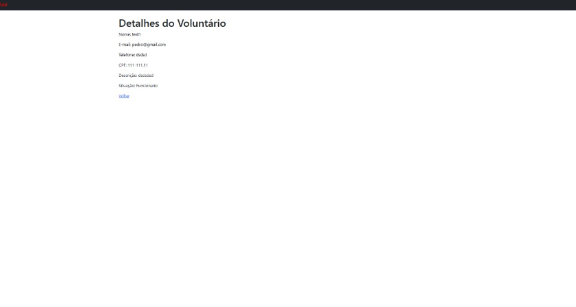
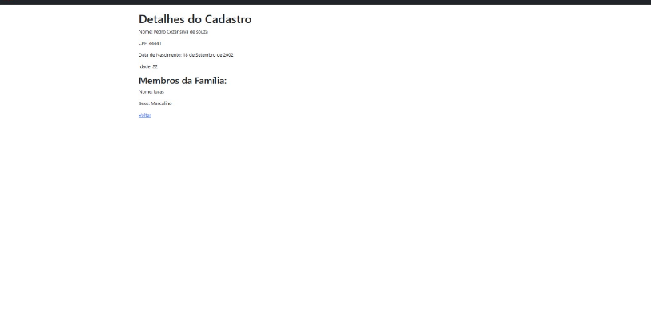
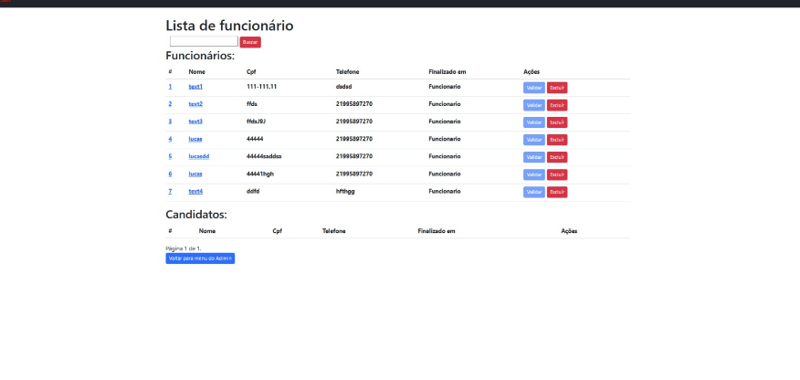


Pedro ficou de finalizar a lógica de remoção de membros das familias e a Stefany o pix e o e-mail.


# Domingo,19/05/24

Definimos algumas bibliotecas para rodar o programa corretamente, além marcar um horário para 
todos fazermos juntos utilizando o pycharm profissional. Pedimos desculpas pelo cancelamento da 
reunião presencial, mas marcamos uma online, marcamos na quinta-feira às 14 horas.

# Terça,21/05/24

Outra reunião fora marcada para realizarmos o preenchimento de um documento relacionado ao
trabalho, a reunião seria no final da noite, pós aula. O caso de uso já estava pronto, além de algumas
outras que finalizamos previamente. Em relação ao mini mundo, ainda faltava a parte de entidades e 
alguns outros quesitos, o conceitual foi finalizado pelo Pedro e Stefany pouco antes das 23 horas, mas 
ainda iriam reforçar para ter certeza que não havia passado nenhum erro. 
Durante a madrugada, algumas coisas tiveram progresso, como a home onde só faltava a inserção de 
alguns link, a documentação do dia estava finalizada e os diagramas estavam sendo feitos, como o caso 
de uso.

# Quinta,23/05/24

Esperamos o contato com o pessoal da ONG, porém eles cancelaram de última hora. Remarcamos a reunião. 
Focamos em finalizar algumas outras coisas, pois iríamos mostrar a ela como o projeto estava ficando, então 
queríamos fazer bem feito.


# Sábado,25/05/24

Iríamos fazer uma reunião do grupo às 17 horas, para finalizar algumas partes do site para a apresentação da ONG, 
tivemos alguns pequenos erros no Deploy, mas o Pedro conseguiu resolver. Esperamos um tempo e continuamos sem 
resposta da ONG, tivemos que remarcar de novo.

# Quarta,29/05/24

Todos passaram o dia estilizando as páginas, Wikten estava finalizando o estilo de alguns botões e Pedro estava 
configurando a parte do MySQL que irá hospedar

# Quinta,30/05/24

Pedro finalizou o banco de dados MySql, porém no mesmo dia tivemos problemas com o CSS novamente.

# Sexta,31/05/24

Hoje demos uma atualizada nas pendências, faltava finalizar algumas páginas, o pix e identar boa parte dos 
código, o foco era finalizar para poder concluir as documentações e o github. Procuramos bugs e erros
espalhados pelo site, tanto ortográficos quanto de código. 

# Sábado,01/05/24

Deixamos tudo que faltava responsivo mas nem tudo havia sido estilizado, faltava resolver alguns botões da 
parte de cadastrar e editar criança, o pix foi finalizado, além do login que teve que ser alterado após a aplicação 
do Crisp. O resto do dia foi finalizando as coisas que precisávamos finalizar, como as estilizações, Wikten fez as 
estilizações e Laize os botões O login e o registro foram concluídos, tanto o formulário em Crisp quanto o novo CSS. 

# Domingo,02/05/24

Definimos as últimas coisas a serem feitas, resolver alguns campos de formulário que estavam assimétricos, trocar a 
fonte de todo o site, mudar o formato de exibição das crianças  e colocar algumas informações em negrito. Os erros no 
banco de dados, nomes e html estavam sendo corrigidos.

# Segunda,03/06/24

Realizamos uma reunião com uma das administradoras do projeto para mostrarmos o resultado final do site, exibimos o funcionamento do site, sua estética e a paginação, o site foi aprovado, elogiou todo o grupo e a finalização do programa.

IMAGEM

# Quinta,06/05/24

A maioria das páginas foram finalizadas, Login, Cadastro, Home Admin, Apoiar, Admin, Voluntários Ainda faltava atualizar 
as tabelas e botões e alguns pequenos fragmentos de texto.

# Sexta,06/05/24

Laize finalizou algumas partes do style e após isso o Pedro atualizou o projeto final, incorporando o style a página final.
Eu comecei a editar o vídeo da última reunião com a ONG, além de finalizar toda a documentação juntando-as em um 
único arquivo. Além de dar início a criação dos slides e da adaptação no GitHub.

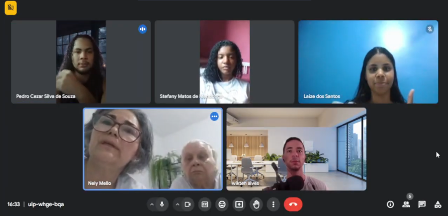